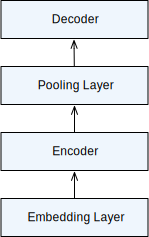
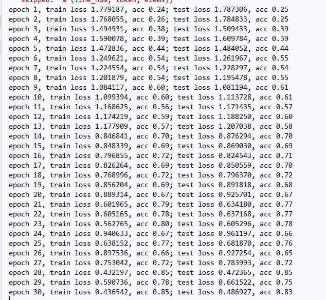

# subject-category

## 基于LSTM的文本分类模型

文本分类模型是一种比较经典的能使用LSTM模型的应用。

## 数据集

实验采用的数据集清华的[THUCNews](http://thuctc.thunlp.org/)，由于原始数据集太大，只抽取了部分数据。THUCNews是根据新浪新闻RSS订阅频道2005~2011年间的历史数据筛选过滤生成，包含74万篇新闻文档（2.19 GB），均为UTF-8纯文本格式。我们在原始新浪新闻分类体系的基础上，重新整合划分出14个候选分类类别：财经、彩票、房产、股票、家居、教育、科技、社会、时尚、时政、体育、星座、游戏、娱乐。

## 数据预处理

训练集：1100 * 7

验证集：100 * 7

测试集：200 * 7

创建sougou.train.txt、sougou.test.txt和sougou.val.txt，存放于dataset文件夹下，其格式为

[类别] \t [新闻内容]

首先根据训练集创建词典vocab，将数据转换为特征向量（本实验的特征向量长度为500）。通过执行`pad_samples`将特征向量补成定长，转换为指定context上的NDArray。使用创建的词典和fasttext词向量创建词典中每个词所对应的词向量。

## 配置RNN模型（基于MXNET） 

我们使用预训练的词向量来初始化`embedding layer`的权重，然后使用双向LSTM抽取特征。具体地，输入的是一个句子即不定长的序列，然后通过`embedding layer`，利用预训练的词向量表示句子，通过LSTM抽取句子的特征，然后输出是一个长度为1的标签。根据上述原理，我们设计如下神经网络结构，其结构比较简单，如下图所示。

模型包含四部分：
1. `embedding layer`: 其将输入数据转化成为TNC的NDArray，并且使用预先加载词向量作为该层的权重。
2. `encoder`: 我们将重点介绍这一部分。decoder是由一个两层的双向LSTM构成。
这样做的好处是，我们能够利用LSTM的输出作为输入样本的特征，之后用于预测。
3. `pooling layer`: 我们使用这个encoder在时刻0的输出，以及时刻最后一步的输出作为每个batch中examples的特征。
4. `decoder`: 最后，我们利用上一步所生成的特征，通过一个dense层做预测。

## 训练与测试数据

我们使用交叉熵作为损失函数，使用准确率来评价模型。经过epoch=30次训练后得到的结果如下：

准确率基本能达到80%，通过增大数据集可以进一步地提高准确率。

## 预测文本分类
给定某个新闻，预测其类别。

## TODO

1. 调整模型层数获取更高的准确率，例如使用更加深层的encoder，即使用更多数量的layer或使用更加有意思的decoder，例如可以加上LSTM，之后再加上dense layer。
2. 目前的实验是基于字符级别的模型，后续使用jieba分词训练基于词向量的模型
3. 数据预处理时使用K折交叉验证
